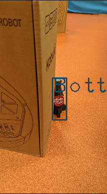
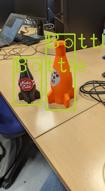
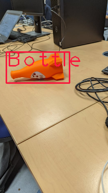

# _Challenge 3_

Voici la branche Challenge3 du groupe Rouge

## _Pré-Requis_

L'exécution de notre code nécessite l'utilisation d'un fichier .weights contenant les résultats de l'aprentissage de notre réseau de neurones. 
Celui-ci dépassant la taille maximale autorisée, il faut le télécharger sous le lien suivant : https://drive.google.com/file/d/1k9ex3AmuKGmZoxvqDPVgwVyrhr3TGt6z/view?usp=sharing
Ce fichier est à placer dans [grp-rouge/vision/](https://github.com/hugovanhille/LARM-Groupe_Rouge/blob/challenge3/grp-rouge/vision/)

De plus,  le fichier [detectbottle.py](https://github.com/hugovanhille/LARM-Groupe_Rouge/blob/challenge3/grp-rouge/scripts/detectbottle.py) contient deux paramètre associés à des chemins locaux à définir. Merci de modifier ces deux chemins présents ligne 17 du fichier detectbottle (remplacer ``/home/hugo`` par ``/home/username/``)

## _Composition_

L'objectif de ce denier challenge est pour notre Turtlebot de se déplacer de façon autonome dans l'espace tout en évitant les obtacles. A çela s'ajoute sa mission de détecter les bouteilles présentes sur le terrain pour ensuite construire la carte sur Rviz et d'y indiquer les bouteilles présentes avec des marqueurs.

Cette branche contient ce fichier README ainsi que le package grp-rouge

Notre stratégie de vision se base sur un réseau de neurones en deep learning entrainé à partir d'une centaines d'images de bouteilles oranges et noires sur un réseau préentrainé de _YOLO_. 
Ce réseau de neurones fonctionne parfaitement lors des test ou on lui donne un jeu d'images à analyser


                                                                                 

Dans le répertoire [scripts](https://github.com/hugovanhille/LARM-Groupe_Rouge/blob/challenge3/grp-rouge/scripts/), on retrouve  4 fichiers python.
- Les fichiers [move_simulation.py](https://github.com/hugovanhille/LARM-Groupe_Rouge/blob/challenge3/grp-rouge/scripts/move_simulation.py) et [move_turtlebot.py](https://github.com/hugovanhille/LARM-Groupe_Rouge/blob/challenge3/grp-rouge/scripts/move_turtlebot.py) commandant respectivement le déplacement du robot de la simulation et du turtlebot kobuki réel. Le déplacement de notre robot repose sur une stratégie de déplacement autonome d'évitement d'obstacles. Lorsque le kobuki détecte un obstacle grace à son détecteur laser, il va choisir de tourner à gauche ou à droite en essayant de se diriger du coté possédant le moins d'obstacles proche.
- Le fichier [detectbottle.py](https://github.com/hugovanhille/LARM-Groupe_Rouge/blob/challenge3/grp-rouge/scripts/detectbottle.py) permet d'analyser les images obtenu par la caméra pour détecter des bouteilles. Nous avons choisis d'analyser une image toute les 1,5s afin de ne pas surcharger l'éxecution.
 Une fois une bouteille détecté, on récupère sa position grace à la caméra 3D, et on envoie l'information sur un topic qui sera récupére par le fichier python suivant.
- Le deuxième ([markbottle.py](https://github.com/hugovanhille/LARM-Groupe_Rouge/blob/challenge3/grp-rouge/scripts/markbottle.py)) s'occupe d'afficher les marqueurs des bouteilles sur Rviz.

Dans le répertoire [launch](https://github.com/hugovanhille/LARM-Groupe_Rouge/blob/challenge3/grp-rouge/launch/) il y a deux fichiers launch NAME qui permettent de lancer la simulation du robot et le turtlebot réel
Les commandes à éxecuter sont les suivantes :
```bash 
roslaunch grp-rouge challenge3_tbot.launch 
```
```bash 
roslaunch grp-rouge challenge3_simulation.launch 
```

Ensuite, le répertoire [vision](https://github.com/hugovanhille/LARM-Groupe_Rouge/blob/challenge3/grp-rouge/vision/) contient l'ensemble des fichiers utiles au bon fonctionnement de notre réseau de neurones (résultats de l'apprentissages et autres informations indispensables à son exécution).

Finalement, le dossier [rviz](https://github.com/hugovanhille/LARM-Groupe_Rouge/blob/challenge3/grp-rouge/rviz/)  permet de lançer rviz dans les bonnes configurations.

## _Auteurs_

Ce projet a été mené par :

* **Hugo Vanhille** _alias_ [@hugovanhille](https://github.com/hugovanhille)
* **Maxence Vandendorpe** _alias_ [@altreon100](https://github.com/altreon100)
